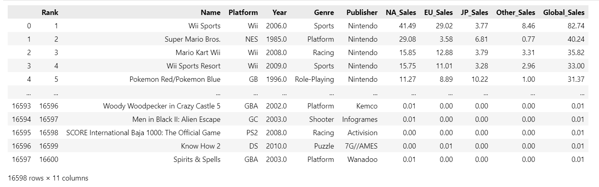

# Validasi Data
Proyek ini hanyalah sebuah validasi data tanpa tindakan lebih lanjut. Validasi Data adalah proses pengecekan dan verifikasi data untuk memastikan apakah data tersebut akurat, konsisten, dan sesuai dengan format atau aturan yang telah ditentukan sebelum digunakan lebih lanjut. Hasil dari proyek ini adalah informasi tentang kesalahan pada dataset ini yang harus ditindak lebih lanjut.

### Tentang dataset
Proyek ini menggunakan dataset 'vgsales' yang merupakan dataset penjualan video games. dataset ini diambil dari platform Kaggle. [Klik untuk mengunjungi Kaggle](https://www.kaggle.com/datasets/kedokedokedo/vgsales).

  

Features pada dataset:
- Rank: Ranking penjualan
- Name: Nama video games
- Platform: Dimana game ini dimainkan/dijual
- Year: Tahun berapa game ini dipublikasikan
- Genre: Genre dari game yang dijual
- Publisher: Publisher game
- Sales features:
  - NA_Sales
  - EU_Sales
  - JP_Sales
  - Other_Sales
  - Global_Sales

### Apa Saja Yang Divalidasi Pada Proyek Ini?
 - Struktur data: apakah tipe datanya sudah sesuai?
 - Missing values: apakah ada data yang value-nya kosong (NaN)?
 - Distribusi data: setelah tipe datanya sesuai, apakah isi datanya juga sudah sesuai? (contoh, gender harusnya hanya ada laki-laki/perempuan. Tidak ada yang lain)
 - Duplikasi data: Memastikan tidak ada data yang 100% sama dengan data lainnya
---

## Struktur Data
  
Pada bagian struktur data, saya menggunakan fungsi info() untuk melihat struktur secara keseluruhan. Hasil dari inspeksi struktur data ini ditemukan bahwa ada kesalahan pada tipe data kolom 'Year', yang dimana akan lebih cocok jika menggunakan tipe data Integer dibanding Float
___

## Missing Values
  

Pada bagian missing values, saya mengecek secara singkat menggunakan heatmap untuk melihat gambaran semua missing values yang ada di dataframe. Setalah saya cek kembali menggunakan metode isnull().sum() ditemukan missing values di kolom 'Year' (271 data) dan 'Publisher' (58 data). Berikut ini adalah tampilan sampel data yang terdapat missing values di salah dua kolomnya:

  
___

## Distribusi Data
Proses pengecekan distribusi data bertujuan untuk melihat apakah ada keanehan pada data di suatu kolom. Pada proses pengecekan distribusi data, saya membagi data menjadi 2 jenis: numerik dan kategorial.

### Kolom Numerik
Pada proses pengecekan kolom numerik saya mengecek distribusi data dan outlayer menggunakan boxplot dan bar chart, berikut ini adalah hasilnya: 

.png)  
  

Pada saat kita melihat grafik bar chart, tidak akan ada yang tampak aneh. Tetapi jika kita melihat pada grafik boxplot, terdapat beberapa titik yang terpisah dari titik lainnya, biasanya hal ini akan dianggap sebagai outlayer. tetapi pada saat saya cek menggunakan metode IQR (Interquartile Range), hal ini sangat lumrah karena memang dalam dunia video games akan ada game yang sangat hebat penjualannya (hukum tidak tertulis = 20% game menyumbang 80% penjualan), hal tersebut bisa dilihat pada hasil IQR berikut ini:

  

### Kolom Kategorial
Pada kolom kategorial, saya melihat distribusi dan outlayer satu persatu menggunakan bar chart, berikut ini hasilnya:

 
  
  

Jika kita melihat pada distribusi 'Platform', ada beberapa data yang jumlahnya sangat sedikit dan hal ini biasanya akan dianggap sebagai outlayer. Tetapi jika kita mencari tahu lebih lanjut, memang ada beberapa game yang bisa di mainkan di platform tertentu, hal ini menjelaskan kenapa ada game yang terjual sangat sedikit di beberapa platform.

Sama hal-nya pada distribusi 'Year'. Pada dataset ini, hanya ada sedikit game yang dibuat pada tahun tertentu yang bisa terjual. Hal ini menjelaskan kenapa ada beberapa game tahun tertentu yang penjualannya sangat sedikit

  
  

Khusus untuk publisher, saya menggunakan pie chart untuk melihat top 10 dan bottom. Saya memilih top 10 dan bottom karena biasanya outlayer yang terpisah akan memiliki nilai yang jauh lebih tinggi atau jauh lebih rendah. Dan jika kita melihat top 1o dan bottom, tidak ada outlayer maupun typo pada kolom 'Publisher'

--- 
## Duplikasi Data
Tujuan dari proses pemeriksaan duplikasi data adalah untuk memastikan tidak ada data yang 100% mirip dengan data lainnya. Saya menggunakan visualisasi sederhana untuk melihat gambaran duplikasi secara keseluruhan, kemudian saya cek kembali dengan metode duplicated().sum() untuk memastikan, berikut ini hasilnya:

  
  

Jika kita melihat visualisasi duplikasi, ada beberapa duplikasi pada kolom 'Year' dan 'Publisher'. Hal ini akan sangat normal pada dunia game, karena memang ada banyak game yang di produksi di tahun yang sama dan publisher yang sama. Hal ini menjelaskan adanya duplikasi di kolom 'Year' dan 'Publisher'. Tentunya hal ini bukan menjadi masalah, karena duplikasi tidak 100%, melainkan hanya terjadi di  dua kolom tersebut.
___

## Kesimpulan
Setelah saya melakukan pengecekan terhadap 4 aspek, kita bisa menyimpulkan bahwa di dalam dataset 'vgsales' ini terdapat beberapa masalah yang harus diperbaiki maupun yang tidak perlu diperbaiki.

### Kesimpulan 4 aspek dalam dataset:
- Kolom 'Year' akan  lebih cocok menggunakan tipe data Integer dari pada Float
- Ditemukan missing values pada kolom 'Year' (271 data) dan 'Publisher' (58 data)
- Tidak ditemukan outlayer pada distribusi data numerik maupun kategorial
- Tidak ada duplikasi data 100% pada dataset ini